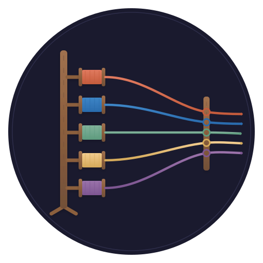

<p align="center">
  
</p>

<h1 align="center">creel</h1>

<p align="center">
  <em>🧺 Parallel agent bursts, entirely in the browser</em>
</p>

<p align="center">
  <a href="LICENSE"></a>
  
  
  
  
</p>

> *A creel is the frame that holds many bobbins at once, each paying out its thread in
> parallel onto the warp. The frame doesn't spin and it doesn't weave — it holds the
> threads in tension while the work happens.* 🧵

**A static web page that runs a fleet of cheap, short-lived coding agents in browser
tabs** — remote LLM calls, WASM tools, a knowledge graph in the page. No server-side
harness, no sandbox to build, no secrets to hold.

Every server-side agent harness pays three taxes: **containment** (sandboxes, guards,
isolation — and the incidents when they leak), **operations** (a process that must stay
up), and **secrets custody** (keys on hosts). creel deletes all three by running where
those problems are already solved:

- **The sandbox is the browser's** — agent-generated code runs in WASM inside the most
  adversarially hardened runtime in existence. Worst-case blast radius: one tab.
- **There is nothing to operate** — the harness is a directory of static files.
- **There are no secrets anywhere you administer** — bring your own API key, held in
  localStorage, never in the served bundle. It can follow you to another browser, but
  only the long way round: encrypted, opt-in, into a private repo that is yours.

## The bet: cheap agents + local knowledge

Frontier-model agents are expensive because each one must *reconstruct context* before
acting. creel bets that **small, cheap models become viable agents when grounding is
local and free**: a [quipu](https://github.com/scbrown/quipu) knowledge graph compiled
to WASM lives in the page, so every agent gets sub-millisecond, zero-token access to
what you already know — entities, constraints, prior decisions — before it acts. Ten
cheap grounded agents for the price of one frontier ungrounded one is the economic
shape of a burst.

## How it works

Tabs are the unit of parallelism — bobbins on the creel. A dashboard tab owns the
queue; each agent tab boots its own WASM toolchain and LLM loop, claims work, and
merges its results back with git. The browser platform does the scheduler's hard parts:

| scheduler concern | browser primitive |
|---|---|
| work leasing | Web Locks — a lock auto-releases when its tab dies |
| crash detection | the same release, delivered synchronously |
| fleet event bus | BroadcastChannel |
| coordinator lifetime | SharedWorker |
| durable queue | IndexedDB |
| agent isolation | per-tab processes + per-agent OPFS directories |
| merge discipline | isomorphic-git — branch per agent, merge at burst end |
| spawning | `window.open()` from the dashboard |

Leasing, liveness, isolation, and the event bus are the parts a server-side fleet has
to build and debug. Here they are platform features.

## What creel is not

creel is for **interactive burst parallelism with a human present** — fan out five
agents on a design for ten minutes, generate and test three variants, sweep a repo in
parallel while you watch. It is deliberately **not durable infrastructure**: the fleet
dies with the browser, there is no cron, and nothing runs unattended. Work that must
outlive your attention belongs to a durable harness like
[shantytown](https://github.com/scbrown/shantytown); creel and a durable fleet
complement, not compete.

## The stack

```text
        interactive bursts                     durable work
   ┌──────────────────────────┐        ┌──────────────────────────┐
   │  creel — this repo       │        │  shantytown — the crew   │
   │  tabs · WASM · BYO key   │        │  sessions · queues · ops │
   └──────┬───────────┬───────┘        └────────────┬─────────────┘
          │           │                             │
   ┌──────▼─────┐ ┌───▼──────────┐          ┌───────▼────────┐
   │ quipu-wasm │ │ WASM tools   │          │ bobbin · hank  │
   │ knowledge  │ │ node · py ·  │          │ code · struct  │
   │ in-page    │ │ git · sqlite │          │ context        │
   └────────────┘ └──────────────┘          └────────────────┘
```

## Nothing here is durable — so there is a door

The browser gives creel its sandbox for free and takes durability away in the same
breath. The VFS, the conversations and the quipu graph live in localStorage,
IndexedDB and OPFS: evictable under storage pressure, invisible to every other
machine, gone with the profile. A harness that pretends otherwise loses your work
eventually and blames the browser.

So state has an explicit door rather than an implied guarantee. `state_push` writes
config, conversations, skills, memory and the knowledge graph — as the same `.db`
bytes the quipu CLI opens — into **a private GitHub repo you own**, as one commit
per push however many objects it carries, uploading only what changed. `state_pull`
brings it back in a fresh browser.

It reuses the harness's existing sync engine (a manifest over content-addressed
objects and blobs, AES-GCM at rest) and swaps only the transport, so the same state
tree is readable whether it went to S3 or to git. creel refuses to push state to a
repository GitHub reports as public — re-checked every push, not trusted from setup
— and carries API keys only when you have both opted in *and* set a passphrase.
Opting in without one doesn't silently half-work: the keys stay local and
`state_status` tells you why.

Point it at your own repo in Settings → State Repo; the layout is specified in
[creel-state](https://github.com/scbrown/creel-state).

## The agents have hands

An agent in creel can do what the operator can, and names things the way a
test author does — by ARIA role and accessible name, never by guessing at CSS.

- **`ui_*` — creel itself, in any tab.** Every tool takes an optional `tab`,
  and the call is carried over a `creel-ui` BroadcastChannel to that tab and
  run against *its* DOM. An agent can list the live tabs, read another
  bobbin's transcript, re-point its provider, type into its chat
  (`ui_prompt`, indistinguishable from the human typing) or hit its stop
  button — the same reach the operator gets by switching windows.
- **`browser_*` — any website.** Opt-in via the
  [creel bridge](extension/README.md) Chrome extension, which injects the
  *same* locator engine into the far page. Without the extension the surface
  is a single `browser_status` tool; installing it is the grant, and the
  bridge refuses to act on creel's own origins so an agent can never puppet
  its harness through the privileged path.

Both sets share one vocabulary, borrowed from Playwright: take a
`snapshot` (the accessibility tree, with `[ref]` handles), then act by
`{ref}` or `{role, name}`. **Every action auto-waits** for its target to be
visible and enabled, so an agent never sleeps; an **ambiguous locator is an
error** listing the candidates, not a coin flip. Every touch flashes a
highlight ring: **orange for agent hands, cyan for human**.

**Credentials go in, never out.** An operator who pastes an API key and says
"set this up" is asking for something an agent should be able to do, so the
write path is open (`ui_fill`, `ui_set_credential`). Every read path is
closed: snapshots mark such fields write-only, results report a character
count rather than a value, and `ui_describe` says only whether a key exists.

Details, and what's still missing, in [docs/hands.md](docs/hands.md).

## Tests

`just test` — 143 assertions, no dependencies and no `node_modules`. The fast
half (69) runs creel's logic against a DOM stub; the other half (74) drives the
**real page and the real extension in real headless Chromium**, over CDP through
Node's built-in WebSocket (`tests/browser.js`). Nothing in the browser tests
reaches into internals to make an assertion pass that an agent could not also
reach. `just test-unit` skips the browser; `just test-ui` runs only it.

## Status

Vision stage — see [docs/VISION.md](docs/VISION.md) for the full architecture,
constraints, and phasing (v0: one tab, many loops → v1: the multi-tab creel →
v2: grounded cheap agents → v3: burst ergonomics).

A first cut of v0 lives in [`app/`](app/README.md): a vendored fork of the
MIT-licensed [OnePagent](https://github.com/sligter/OnePagent) single-file
harness (`just serve`), extended with a quipu transport switch
(`app/quipu-backend.js`) — knowledge tools reach the agent over MCP from
bobbin's server today, and bind to in-page quipu-wasm when it lands — plus
DeepSeek connectivity direct from the page (CORS shims in
[`proxy/`](proxy/) kept as fallback). VISION.md's
fork-vs-greenfield note predates finding OnePagent; vendoring it as the v0
shell was chosen 2026-08-13.

## License

[MIT](LICENSE)
